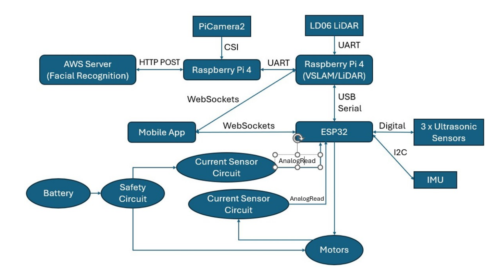

# Group 23 V2 project
This project involves an autonomous police officer robot.

# Overall Project


# Notes
https://www.notion.so/EEE-EIE-Year-2-Project-1f29dbf38692808ba946e09bc3c01eee?pvs=4

# Report
https://www.overleaf.com/project/682bb43ecfe6145d24737e22

- VSLAM (Louis & Sam)
- Tensorflow (Facial Recognition (Ander & Sami))
- Deploy server stuff (Pi Rong)
- Camera for facial recognition (Pi Rong)
- Controls (Sadig)
- Telemetry, Websocket and Mobile App (Sami)

# Github Structure

```
.
├── README.md                  # Project overview and setup instructions
├── images/
│   └── overallDiagram.png     # System architecture or component diagram
├── esp32-starter/             # Codebase for ESP32 microcontroller setup
│   ├── .vscode/               # VSCode settings (e.g. launch/debug configs)
│   ├── facial_recognition/    # Face recognition system (Python-based)
│   │   ├── build_db.py              # Script to build the face embeddings database
│   │   ├── camera_capture.py        # Captures images from camera
│   │   ├── embeddings.pth           # Saved face embeddings
│   │   ├── face_recognizer.py       # Face comparison and recognition logic
│   │   ├── face_recognizer_server.py# Server wrapper for the recognizer
│   │   ├── image_utils.py           # Image preprocessing utilities
│   │   ├── main.py                  # Main script to run recognition locally
│   │   └── server.py                # Flask (or similar) API server
│   ├── include/
│   │   └── README                   # Header files (used in C++ ESP32 code)
│   ├── lib/
│   │   └── README                   # External libraries if any
│   ├── src/                         # C++ source code for ESP32 firmware
│   │   ├── main.cpp                 # ESP32 program (Control + Websocket)
│   │   └── step.h          
│   ├── test/                        # Test code and test files
│   ├── .gitignore                  # Git ignore rules
│   └── platformio.ini              # PlatformIO project configuration
├── raspberrypi/                # Code for Raspberry Pi integration
│   └── rpi-object-detection/
│       ├── detection.py             # Object detection pipeline
│       └── face_detection_yunet_2023mar.py  # Face detection with YuNet model
├── MobileApp/
```
